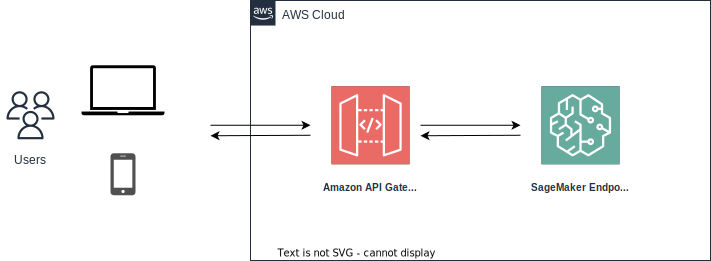

Philosophy
**********

Science, Engineering, and Product
=================================

Science or Engineering?
-----------------------

Data scientists typically focus on building models, but not necessarily deploying them. ML engineering skills are required to take a model and expose it as an API, deploy it to a cloud service, monitor it, and maintain it - all of which are required for production use.

The field of machine learning is trending towards more engineering rigour. Models no longer just need to perform well on paper, they need to thrive in **production systems**. Having knowledge of ML engineering shows the ability to build models with production quality, scalability, and reliability.

Project or Product?
-------------------

When talking about data science, a widely adopted mindset is that it follows a **project workflow**: start with business requirements, work out a rough solution, get the data and explore it, do research and develop algorithms, and deploy it. The general idea behind this mindset is logically correct. However, it also has a clear drawback - it focuses on the project setup but underestimates the **application or product** nature of data science.

Data science is not just about modeling and insights, but about integrating those capabilities into real products and systems. While a project-based workflow is useful for pilots and prototypes, it does not translate well to long-term solutions. **Product lifecycles** are iterative, evolving to changing needs. Data science applications must have the same continuous progression.

Science or Product?
-------------------

**Build models that matter**. Data scientists tend to get excited about building sophisticated models that yield a slightly better accuracy score. But models only matter if they impact the product and business in a meaningful way. Product sense is critical for data scientists to build models that address real user needs and business priorities. 

**Communicate value**. It is not enough to build a model, data scientists must communicate its value to stakeholders. Product sense allows a data scientist to articulate how a model improves the customer experience, benefits metrics, increases revenue, reduces costs, or otherwise contributes value to the product. This is key to getting adoption and buy-in.

**Focus efforts**. There are endless possibilities for analysis and modeling, but resources are limited. Product sense guides data scientists to focus their efforts on the areas that will drive the most value according to business needs. They can see the big picture and understand how to strategically invest time.

**Create solutions, not just insights**. Gaining a flash insight from data is not the end goal. The key is turning insights into real solutions that can gain adoption. Product sense allows data scientists to think through how insights can be built into a product to best serve users and achieve business goals. They can craft data products, not just static reports.

Two Approaches: API and Pipeline
================================

API-first DS
------------

An **API-first** approach is crucial for machine learning models in production. By deploying models behind well-designed APIs, they become easy to integrate, scalable, and flexible.

Exposing models through APIs allows them to be consumed from any client - web, mobile, cron job, etc. This decouples models from individual integrations and unlocks use cases across an organization. APIs also abstract away the complexity of the model, providing a simple interface for clients to get predictions. This means new models can be swapped in without disrupting clients.

With an API layer, models can be deployed centrally and consumed by many clients. This is more resource efficient than deploying models separately for individual apps. It also allows for optimal scaling - you can scale the API to handle increasing traffic instead of scaling multiple model deployments.

APIs enable evolution and improvement of models over time while maintaining backward compatibility. By versioning APIs, models can change without breaking existing clients. This provides stability for clients while allowing models to be retrained and updated.

.. note::

    For more about **real-time** data science or machine learning, I recommend `Chip Huyen's blog <https://huyenchip.com/2022/01/02/real-time-machine-learning-challenges-and-solutions.html>`_.

Pipeline DS
-----------

Two-flow Design
~~~~~~~~~~~~~~~

The **BatCat** abstracts the data science practice into **two main flows: 1) the data flow and 2) the workflow**. Each flow has its place to **store: 1) S3 and 2) GitHub** and interact at computing stage: the **Docker container**.

.. image:: images/flows.svg
  :align: center
  
**The data flow** moves from the storage (AWS S3 here) to the process stage, becomes insights which is also data, and finally stores back to storage for further usage, like BI or UI/UX presentation. From this perspective, a data science product is more like **a data processing**. 

**The workflow** is triggered by events or requests or on schedule to process the data flow; and itself is managed and stored in GitHub or any other Git repository hosting services. From this perspective, a data science product is more like **a software product**.

**The two flows converges in the computing process, which happens in the Docker container in the BatCat setting.** And this is where the data science algorithms really make magic.

Machine Learning Operations (MLOps)
~~~~~~~~~~~~~~~~~~~~~~~~~~~~~~~~~~~

Setting up a data science or machine learning workflow in the production environment follows the philosophy above but with more functions and services on AWS. The related services fall into four main categories:

1. **Data Science Experiments**: SageMaker, Git, Docker.
2. **Storage**: S3, RedShift, Athena.
3. **Processing Container**: Docker, Step Functions, ECR.
4. **Trigger**: Lambda.
5. **Monitor**: CloudWatch.

.. note::
    
    1. The data science experiments can be done in SageMaker but not necessarily since it costs as you start a Jupyter instance. Generally we suggest you do experiments on on premise or on your laplop if possible.
    2. The above landscape is based on the services avaible in AWS China so there remains space to improve when more serivices are accessible. 
    3. The Git services can be GitHub, GitLab, or any satisfies your team's policy. 

