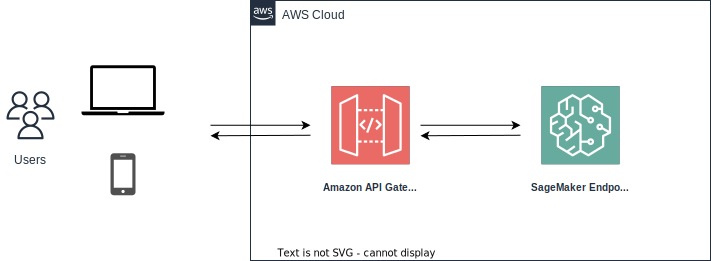

Tutorials
*********

Data Science Projects Basics
============================

Environment Setup
-----------------

The first step to start a data science project should always be setup a development file system, no matter on cloud or in your laptop. **BatCat** provides a one-line command to setup a well-organized file system for data science projects.

.. code-block:: bash

    python -m batcat.FileSys

The interactive and immersive command-line interfaces as following. Just type down your project name, like :code:`battery` in this tutorial. Then it will generate a file structure for your data science project and print out a file tree of it. 

::

    hi, there! please write down your machine learning project's name.
    project's name: battery
    project_battery/
        requirements.txt
        README.md
        .gitignore
        docs/
            READM.md
        log/
        model/
        test/
        data/
            tmp/
            train/
            test/
            result/
            raw/
        notebook/
        report/
        script/
            config.json
        deploy/
            init.py
            config.json

.. note::

    1. :file:`requirements.txt` includes all packages you need in your project. We recommend you to list not only package names but thier versions in the file. Besides, this serves your well if you develop your project on SageMaker, for you have to install all required packages every time restarting the Jupyter Notebook instance.
    2. :file:`.gitignore` includes :file:`data/*` by default, which is our best practice in data science projects with **git**. Generally, you don't want to git your data. 
    3. :file:`docs/READM.md` is inspired by `How to ML Paper - A brief Guide <https://docs.google.com/document/d/16R1E2ExKUCP5SlXWHr-KzbVDx9DBUclra-EbU8IB-iE/edit?usp=sharing>`_. We highly recommend you to document your data science project in an organized way so that anyone, including youself, can catch up your thoughts in the future.

Logging
-------

Most data scientists spend little time on logging and may just print out along the experiement in Jupyter Notebook. However, this can make annoying troubles when it comes to production environment or when the data science experiements require a long period to generate experiement records. Therefore, logging is critical to a data science project. 

Python Module **Logging** is one of the most underrated features. Two things (5&3) to take away from **Logging**: 

1. **5 levels** of importance that logs can contain(debug, info, warning, error, critical);  
2. **3 components** to configure a logger in Python (a logger, a formatter, and at least one handler).

**BatCat** provides a function :code:`get_logger` to make life easier.

.. code-block:: Python

    import batcat as bc
    
    log_name = 'battery'
    log_file = '../log/batter.log'

    logger = bc.get_logger(logName=log_name, logFile=log_file)
    
    logger.debug('this is a debug')
    logger.info('this is a test')
    logger.warning('this is a warning')
    
    logger.error('this is an error!')
    logger.critial('this is critical!')

Configuration
-------------

Just like logging, the importance of configuration is usually underestimated by data scientist but very crutial for machine learning engineers. Without configuration, you have to revise your core code time to time and expose the code to large risks.

We suggest you to store all your environment configurations in a :code:`json` file and load it to your core code as a Python :code:`dictionary` each time. This allows to keep your core machine learning code independent from these configurations so that can be transfered from **development** environment to **production** one smoothly. 

.. code-block:: Python

    import batcat as bc

    config = bc.get_config(file='config.json')

Clean Code
----------

To improve your machine learning code readability, we recommend `pipe <https://pandas.pydata.org/docs/reference/api/pandas.DataFrame.pipe.html>`_ of :code:`pandas`. The following is a sample code for inference -- we structure the **preprocessing** and **feature engineering** tasks as pipe functions and stack them together as a pipeline. 

.. code-block:: Python
    
    import batcat as bc
    
    # read data
    df = bc.read_csv_from_bucket(bucket, key)
    
    # preprocessing and feature engineering
    df = (df.pipe(func1)
            .pipe(func2, arg1=a)
            .pipe(func3, arg2=b, arg3=c)
    )
    
    # inference
    results = model(df)
    
    # save results
    bc.save_to_bucket(results, bucket, key)

After the pipeline is set up, you only need to revise each single pipe to tune your feature engineering, which doesn't affect any other process in your code.

.. note::
    
    The code above utilize the I/O tools of **BatCat**, which provided as following section.

IO Tools
========

**Services on AWS**: S3, Redshift, Athena. 

**BatCat** supports reading data from S3 bucket (directly or by Athena or Redshift) and saving back to S3.

S3 Bucket
---------

Read CSV data directly from S3 and save a DataFrame to S3.

.. code-block:: Python
    
    bucket = '2022-RnD-battery'
    key = 'usage'
    
    # from s3
    df = bc.read_csv_from_bucket(bucket, key)
    
    # to s3
    bc.save_to_bucket(df, bucket, key)

SQL: Redshift, Athena
---------------------

The above approach is fine with a given S3 object but can be tricky when it comes to scenarios you need write SQLs to query data. This can be handled with Athena and Redshift. 

1. **Redshift**: 
    - Option 1: With host/password.
    - Option 2: With Secrets Manager.
2. **Athena**: Service Glue is required before you query with Athena.

.. code-block:: Python

    # from RedShift
    query = """
    SELECT 
        vin,
        usage,
        time
    FROM 
        cdc_dw_bms.battery_usage
    WHERE
        time >= '{}' and time <= '{}'
    """
    
    date_start = '2022-01-01'
    date_end = '2022-08-01'
    
    ## with host/password
    host = '0.1.1.1'
    password = 'this_is_a_password'
    
    df = bc.read_data_from_redshift(query=query, 
                                    host=host,
                                    password=password,
                                    port=5439,
                                    database='dev',
                                    user='awsuser',
                                    date_start=date_start, 
                                    date_end=date_end)
    
    ## with secrets manager
    secret_name = 'secret/manager'
    
    df = bc.read_data_from_redshift_by_secret(secret_name=secret_name, 
                                              region=region, 
                                              query=query)
    
    
    # to RedShift
    schema = 'your_result_schema_name'
    table_name = 'your_result_table_name'
    
    bc.save_df_to_redshift(df, 
                           host=host, password=password, port=5439, database='dev', user='awsuser',
                           table_name=table_name, schema=schema)

The functions above are based on the package **redshift_connector** but more user-friendly for data scientists. You can read data from and save it to RedShift in your data science projects. 

.. note::
    
    1. If you don't specify :code:`schema` with :code:`bc.save_df_to_redshift`, it will save to :code:`public` by default, which is not recommended for database management reason.
    2. You may want to add a **timestamp column** to your dataframe with :code:`bc.save_df_to_redshift` so that you can distinguish potential duplicated rows with :code:`if_exist="append"`. 

Unlike RedShift, Athena is a serverless service and does not need any infrastructure to create, manage, or scale data sets. It works directly on top of Amazon S3 data sets. It creates external tables and therefore does not manipulate S3 data sources, working as a read-only service from an S3 perspective.

.. code-block:: Python

    # via Athena
    query = """
    SELECT 
        vin,
        usage,
        time
    FROM 
        cdc.dw_bms.battery_usage
    WHERE
        time >= '{}' and time <= '{}'
    """
    
    date_start = '2022-01-01'
    date_end = '2022-08-01'

    region = 'cn-northwest-1'
    s3_staging_dir = "s3://apac-athena-queryresult/ATHENA_QUERY"
    
    df = bc.read_data_from_athena(query=query, 
                                  region=region,
                                  s3_staging_dir=s3_staging_dir,
                                  date_start=date_start, 
                                  date_end=date_end)

.. note::
    
    1. Pay attention to the queries for RedShift and Athena are different.
        - **RedShift**: :code:`[datasource]_[database]` as schema.
        - **Athena**: :code:`[datasource].[database]`
    2. As Athena works directly on top of Amazon S3 data sets, you may save your results to S3 with tools :ref:`directly saving to S3 Bucket <tutorial:IO Tools>` .

Deployment on Cloud
===================

We notice there are many combinations of services on AWS can serve the machine learning deployment, like 1) Lambda, ECR, 2) Lambda, EFS, 3) Lambda, SageMaker, Step Functions, 4) SageMaker built-in methods etc. Here we provide two practices as following.

As an API
---------

**Services on AWS**: SageMaker, API Gateway. 

SageMaker is AWS's managed machine learning service. With SageMaker, you can deploy trained ML models as inference endpoints. These are REST APIs that can be called to get predictions from your model on new data. SageMaker takes care of provisioning resources, scaling your endpoint, and monitoring.

API Gateway is AWS's API management service. It allows you to create REST APIs, deploy them, monitor them, and manage access to them. You can use API Gateway to create an API for your SageMaker endpoint and manage access to it.

A typical deployment workflow would be:

1. Train your model and save it - either using SageMaker training jobs or on your own environment.
2. Create a model package with the artifacts required to deploy your model. This includes files like model.tar.gz, code, and dependencies.
3. Create an endpoint configuration which specifies hardware resources like instance type.
4. Create an inference endpoint from the model package and endpoint configuration. This deploys your model as a REST API.
5. (Optional) Use API Gateway to create an HTTP API for your endpoint and add features like caching, throttling, access control, etc.
6. Call your endpoint/API to get predictions from your model.
7. Monitor and scale your endpoint as needed to handle changing traffic.

.. code-block:: python

    import batcat as bc
    from sklearn.linear_model import LogisticRegression
    
    # Train model
    lr = LogisticRegression()
    lr.fit(X_train, y_train)
    
    # Deploy model
    endpoint_name = bc.deploy_model(model=lr, model_name='battery-lr', bucket='2022-rnd-battery')
    
    # Invoke and test model
    results = bc.invoke(endpoint_name=endpoint_name, input_data=X_test)
    

.. note::
    
    There are a few key benefits of an API-first approach for machine learning:
    
    1. Easy integration - Exposing your ML model through an API allows it to be easily integrated into applications. The API acts as an abstraction layer that hides the complexity of the model and lets applications get predictions through a simple API call.
    2. Flexibility - An API gives flexibility to use the model from different client environments. You can have web clients, mobile clients, cron jobs, etc all accessing the same model API. Without an API, the model would be locked into a single integration.
    3. Scalability - An API allows you to decouple the model deployment from individual client integrations. If you have 10 web apps accessing a model API, you only need to deploy one model endpoint. Versus deploying the model separately for each application. This is more resource efficient and scalable.
    4. Monitoring - Monitoring an API is easier than monitoring multiple model integrations. You get aggregated metrics on API calls, latency, errors, etc. This gives more visibility into how the model is performing in production.
    5. Caching - You can enable API caching to improve response times and reduce load on the model. Caching at the API layer is not possible if the model is integrated directly into applications.
    6. Access Management - Use API Gateway to control access to your model API. Manage which clients can access the API, throttling policies, quotas, etc. This gives more security and control than individually managing access for each model integration.
    
    So in summary, an API-first approach leads to more robust, scalable, flexible, and secure ML deployments. The API acts as the single point of entry for all applications to access the model. And API management features can be leveraged to gain visibility, enhance performance, and control access. An API-first ML architecture is a best practice for production environments.
    

As a Datapipeline
-----------------

**Services on AWS**: ECR, SageMaker, Step Functions, and Lambda. 

Before we dive in the topic, let's align on the meaning of "deployment on cloud". This basicly involves **microservice** like container and **serverless**. In the AWS context, it related services:

- ECR
- SageMaker Processing
- Step Functions
- Lambda
- IAM

Amazon SageMaker lets developers and data scientists train and deploy machine learning models. With Amazon SageMaker Processing, you can run processing jobs for data processing steps in your machine learning pipeline. 

However, the most annoying part of SageMaker is that it offers many modules *to faciliate* model development and deployment but looks like a white elephant. What a data scientist need is something with shallow learning curve and the knowledge can be transfered to other cloud services, **NOT** something only works on AWS, which betrays the intend to use Docker! 

So here's BatCat. It provides templates to setup docker images, workflows of Step Functions, and triggers generated by Lambda functions -- to slim down the setup work on AWS. 

.. image:: images/process.svg
  :align: center

**BatCat** takes all steps in a machine learning product as processing jobs -- data cleaning, preprocessing, feature engineering, predicting. Note that the training step is not in production stage but development stage so not inlcuded here.

Initialize
~~~~~~~~~~

1. Create related roles and attach policies to it. 
    Like any other AWS services, roles and policies setup is one of the most disappointing parts when using it. Refer to :ref:`Identity and Access Management <appendix:Identity and Access Management (IAM)>` for more information.
2. Go to :file:`deploy/` folder and setup templates:
    1. Revise :file:`config.json` **BatCat** generated for your purpose (check the code below).
    2. Run :file:`init.py` script.
3. Add your data science core script.
    1. Add your data science Python script to the current directory, whose name should aligned with :code:`purpose`. In the example below, it is :code:`usage-analysis.py`.
    2. Revise your output destination with :code:`bc.processing_output_path`.
4. Run the scripts to deploy.
    That's it!

All configurations you need to setup are stored in :file:`config.json`.

.. code-block:: json
    
    {
        "project":  "2022-rnd-battery",
        "purpose":  "inference",
        "result_s3_bucket":  "2022-rnd-battery-dev",
        "partition":  "aws-cn",
        "workflow_execution_role":  "arn:[partition]:iam::[account-id]:role/[role-name]"
    }

.. note::

    1. :code:`project`: your data science project name. We suggest a format as :code:`[year]-[domain]-[topic]`.
    2. :code:`purpose`: or subproject under a project. 
    3. :code:`result_s3_bucket`: the S3 bucket to store data science results. 
    4. :code:`workflow_execution_role`: the role ARN you created in step 1. 

Setup a result path within container so that the Step Functions can find and save the output to S3 later.

.. code-block:: python

    import batcat as bc

    output_path = bc.processing_output_path(purpose, timestamp=True, local=False)

    results.to_csv(output_path, index=False)

Then we obtain a :file:`deploy/` file structure as following.

::

    deploy/
        2022-RnD-battery-inference-trigger/
            lambda_function.py
        docker/
            Dockerfile
            requirements.txt
        inference.py
        init.py
        config.json
        requirements.txt
        setup_docker.sh
        setup_stepfunctions_inference.py

Deploy it!
~~~~~~~~~~

1. Add your Python packages to the :file:`requirements.txt`.
2. Run :file:`setup_docker.sh`.
3. Run :file:`setup_stepfunctions_inference.py`.
4. Go to **Step Functions** on AWS to check the status.
5. Go to **Lambda** on AWS and copy the :file:`lambda_function.py` to it.
6. Go to **Cloud Watch** on AWS to set up an **Event Bus** for the trigger.
